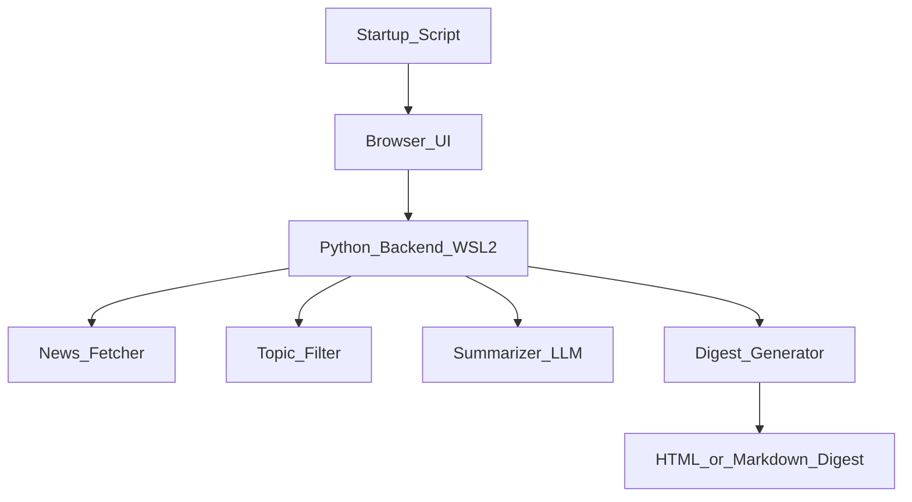

# Automated News Summarizer (Phase 1 — Text Only)

## Overview
The Automated News Summarizer is a desktop-startup program that fetches global news, filters it by user-selected topics, summarizes the articles using AI, and presents a clean daily digest when the computer starts.

This is **Phase 1 (Text Only)**:
- Fetch news from RSS feeds or APIs
- Filter by user topics
- Summarize using LLMs
- Generate a daily digest (HTML/Markdown)
- Display digest automatically on Windows startup

Future phases:
- Phase 2: Audio summaries
- Phase 3: Video summaries

---

## Architecture

### High-Level Flow
1. Windows boots → Startup script runs  
2. Browser opens `http://localhost:8000/digest`  
3. Backend (running in WSL2)  
   - Fetches news  
   - Filters by topics  
   - Summarizes  
   - Generates digest  
4. Digest displayed to user

### Components
- **Windows**
  - Startup script
  - Browser UI
- **WSL2 (Ubuntu)**
  - Python backend
  - News ingestion
  - Topic filtering
  - Summarization engine
  - Digest generator
  - Local storage

---

## Architecture Diagram (Optimized Overview)

**System Structure:**

```
┌─────────────────────────────┐
│       Windows OS            │
│ ─ Startup Script            │
│ ─ Browser UI                │
└────────────┬────────────────┘
             │
             ▼
┌─────────────────────────────┐
│     WSL2 (Ubuntu)           │
│ ─ Python Backend            │
│    • News Fetcher           │
│    • Topic Filter           │
│    • Summarizer (LLM)       │
│    • Digest Generator       │
│    • Local Storage          │
└─────────────────────────────┘
```

---

## Architecture Diagram (Mermaid)

